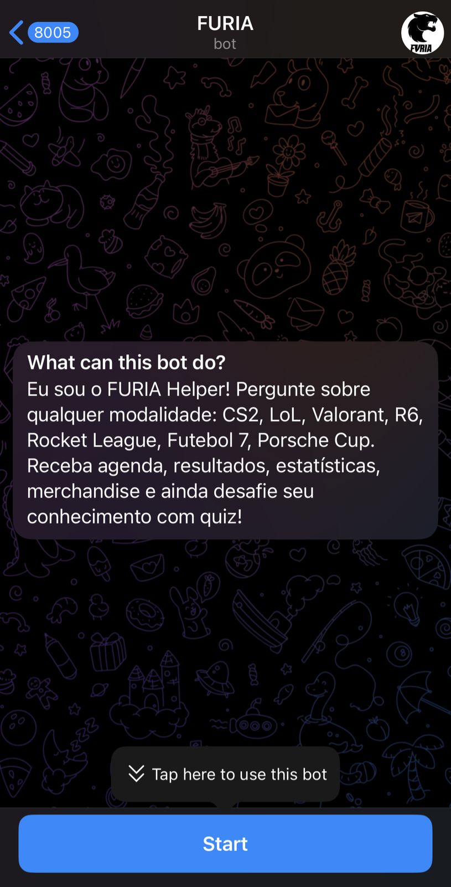

# FURIAHELPER\_BOT 🐾🔥

**Chatbot oficial da torcida FURIA no Telegram**, criado com **n8n** + **Gemini AI** para entregar uma experiência interativa, personalizada e cheia de emoção Black & Bold!

Desenvolvido por [Victor Russo](https://www.linkedin.com/in/victorrusso7) para o **Desafio Técnico #1 da FURIA Tech**.

---

## 🎯 Sobre o projeto

O **FURIAHELPER\_BOT** foi pensado para criar um canal de comunicação entre o torcedor e a equipe, com informações atualizadas, bom humor e estilo. Com ele, os fãs podem:

* Ver o calendário atualizado de **todas as modalidades**
* Conferir **resultados dos últimos jogos**
* Consultar o **elenco atual por time**
* Acessar **produtos oficiais** e redes sociais da FURIA
* Jogar um **quiz interativo**
* Tudo isso com **respostas carismáticas e identidade da torcida**

---

## ▶ Demonstração



**Assista o bot funcionando:**
[▶ Ver vídeo da demonstração](docs/demo.mp4)

---

## 🧠 Tecnologias utilizadas

* [n8n](https://n8n.io) — ferramenta de automação e criação de fluxos low-code
* [Gemini Pro](https://ai.google.dev) — modelo de IA da Google para respostas inteligentes
* [Telegram Bot API](https://core.telegram.org/bots/api)
* HTTP Request para APIs externas (ex: Draft5)
* Simple Memory (armazenamento e contexto do usuário)

---

## 📁 Estrutura do projeto

```
furia-telegram-bot/
├── workflows/
│   └── furiabot-n8n-workflow.json  # Fluxo principal n8n
├── docs/
│   ├── demo.mp4                    # Vídeo de demonstração
│   └── menu.png.jpeg               # Tela inicial do bot
├── .gitignore
└── README.md
```

---

## ⚙️ Como usar

### 1. Clone o repositório

```bash
git clone https://github.com/victorrusso7/furia-telegram-bot.git
cd furia-telegram-bot
```

### 2. Importe no n8n

* Crie um novo Workflow
* Clique nos 3 pontinhos > Import from file
* Selecione o arquivo: `workflows/furiabot-n8n-workflow.json`

### 3. Configure os acessos

* **Token do Telegram** (via [@BotFather](https://t.me/BotFather))
* **API Key do Gemini** (via Google AI Studio)

### 4. Ative o Workflow

* Clique em **Activate**
* Fale com o bot em: [@FURIAHELPER\_BOT](https://t.me/FURIAHELPER_BOT)

---

## 🧩 Funcionalidades

* **Interação personalizada com emojis e linguagem da torcida**
* **Menu com 7 opções principais**:

  * 1️⃣ Próximos Jogos
  * 2️⃣ Últimos Jogos
  * 3️⃣ Elenco
  * 4️⃣ Produtos Oficiais
  * 5️⃣ Redes Sociais
  * 6️⃣ Modalidades
  * 7️⃣ Quiz da FURIA
* **Memória do usuário** (nome, desempenho no quiz, preferências)
* **Quiz com pontuação**
* **Suporte multilíngue PT/EN/ES (via language\_code)**

---

## 📌 Observações

* As opções são escolhidas via **número digitado**, não por botão (Telegram API restrita em bots n8n).
* A aba de **notícias** e os **botões clicáveis** podem ser incluídos em versões futuras.
* O vídeo está compactado para manter o limite de tamanho do GitHub (< 100MB).

---

## 📢 Desenvolvido por

**Victor Russo**
[LinkedIn](https://www.linkedin.com/in/victorrusso7)
Criado com ❤️ para o desafio da FURIA Tech

---

**#GoFURIA** 🖤
**#BlackAndBold**
**#FuriaTechChallenge**